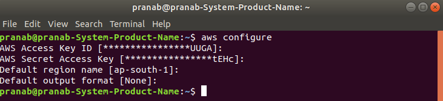
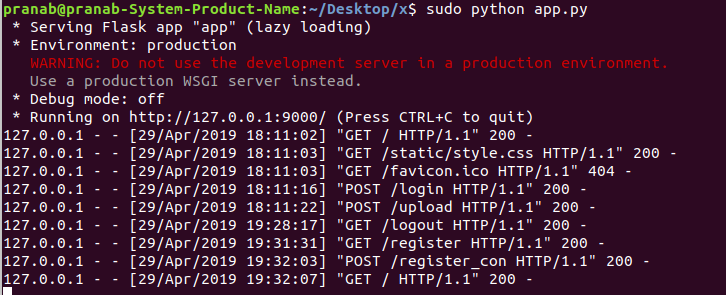

# pdf_uploader_flask_webapp_aws

The `requirements.txt` file should list all Python libraries that your script depend on, and they will be installed using

```
pip install -r requirements.txt
```

The file structure of this project is given below

```
flask_pdf_aws/
├── app.py			 
├── requirments.txt	 
├── README.md
├── templates
│   ├── login.html
│   ├── regsiter.html
│   ├── reg_sub.html
│   ├── upload.html
│   ├── upload2.html
├── static
│   ├── style.css
├── images
├── uploads
```

When the user opens the portal to upload their pdf files, they are provided with two options. Either they can log in using their existing credentials or simply they can sign up using their details to start uploading. Once the user has completed the registration process an email will be sent to their registered email id's which will contain the login credentials, as well as their details, will be uploaded inside the AWS DynamoDB.

When the user will try to log in the details will be compared with the database present in AWS DynamoDB. After logging inside the portal, the user can upload multiple files. Once the user submits the files they are uploaded inside the AWS S3 bucket and a log is added inside the DynamoDB. After uploading the files the user can also view the list of the uploaded files with the option of logging out of the portal. I have used sessions and cloud storages for each login to ensure **security** and **data integrity**. 

YouTube Link: https://youtu.be/BoWNN9XLi5Y 

# Steps to configure the system:

## 1. Setup AWS CLI

Type the following inside the terminal to configure the credentials.

```
aws configure
```



 										   

Here, I have used Access Key ID and Secret Access Key which were provided inside my AWS console.

**Why to configure AWS CLI ?**

To create a **secure** and a stable system I am using AWS DynamoDB to store the user credentials as well as log data and the pdf files will be uploaded into a AWS S3 bucket to maintain **data integrity**. Hence, to use these services it is essential to configure the AWS CLI. 

## 2. Start the server

Type the following inside the terminal to start the flask server in port 9000.

```
python app.py
```



​				*The webapp can be accessed inside a web-browser in this address: http://127.0.0.1:9000/*

