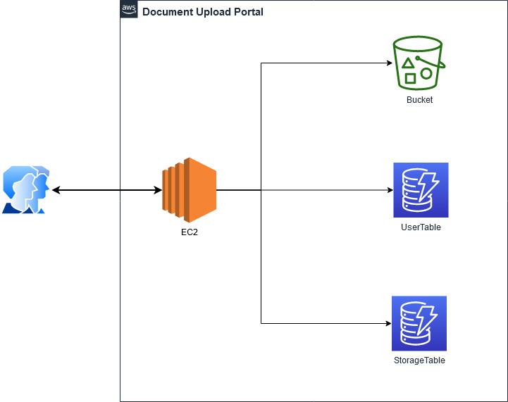

# pdf_uploader_flask_webapp_aws

This a light weight flask application which could be used to upload files securely into cloud storage.

YouTube Link: https://youtu.be/BoWNN9XLi5Y 

## Overview - High Level Diagram

## Background

When an user opens the portal to upload their pdf files, they are provided with two options. Either they can log in using their existing credentials or simply they can sign up using their details to start uploading. Once the user has completed the registration process an email will be sent to their registered email id. It will contain the login credentials, as well as their details, will be uploaded inside the AWS DynamoDB.

When the user will try to log-in, the details will be compared with the database present in AWS DynamoDB. After logging inside the portal, the user can upload multiple files. Once the user submits the files they are uploaded inside the AWS S3 bucket and a log is added inside the DynamoDB.

## Author

Name: Pranab Sarkar

Please feel free to add your input's :)

